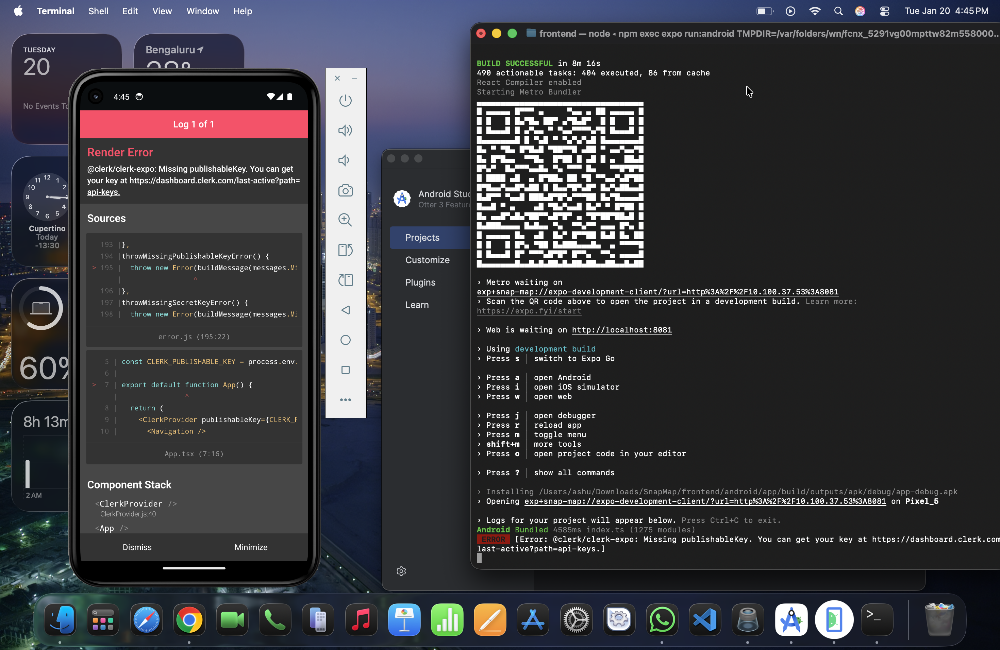
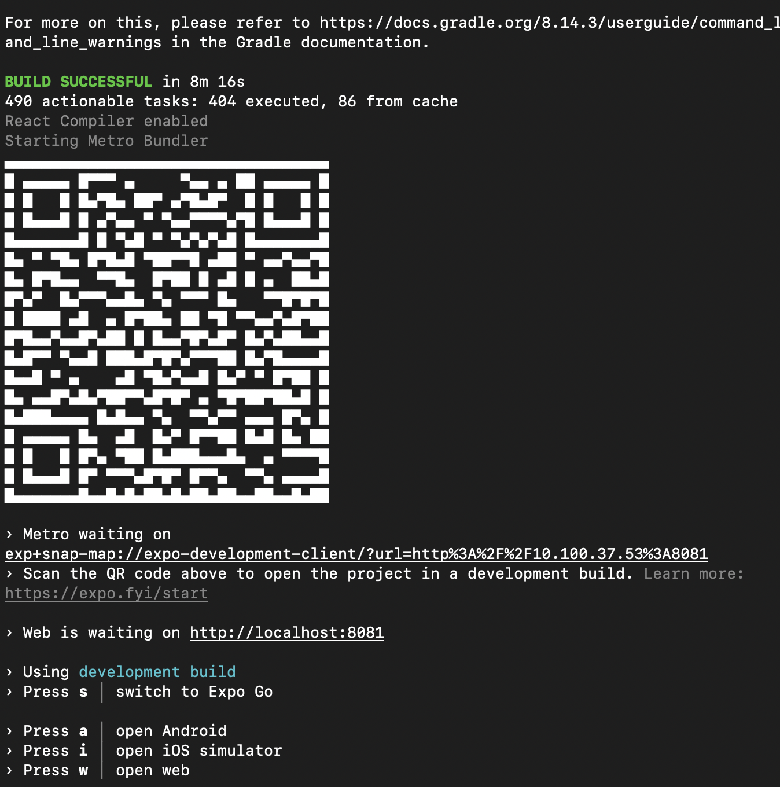
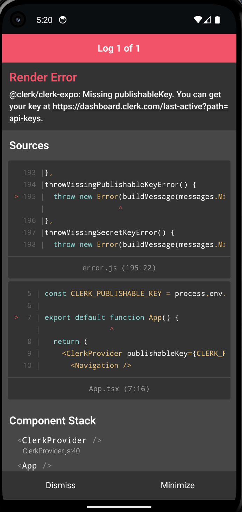

Android Native Setup Guide for SnapMap (Expo → Native)

Author: eshaanag
Branch used: crop-feature
OS: macOS (Apple Silicon)
Target: Run SnapMap using Expo Dev Client / Native Android build instead of Expo Go

## Why this was needed

Initially SnapMap was being run using **Expo Go**, but some features like **image cropping** use **native libraries** which do not work inside Expo Go.

So the app must be run as a **full native Android app** using **Expo Prebuild + Android Studio**.

This document explains **exactly what I did** to make SnapMap run as a native Android app.

---

## My System

- macOS (Apple Silicon)
- Node.js installed
- Android Studio latest version
- Java 17
- Emulator: Pixel 5 (API 34)

---

## Step 1 — Install Android Studio

I downloaded Android Studio from:

https://developer.android.com/studio

Then opened it and completed the **Standard Setup**.

---

## Step 2 — Setup Android SDK & Emulator

From Android Studio:

- Opened **Device Manager**
- Clicked **Add Device**
- Created **Pixel 5 (API 34, ARM64)**

---

## Step 3 — Setup Environment Variables

I added this to `~/.zshrc`:

export ANDROID_HOME=$HOME/Library/Android/sdk
export PATH=$PATH:$ANDROID_HOME/emulator
export PATH=$PATH:$ANDROID_HOME/platform-tools

Then ran:

source ~/.zshrc
adb --version

---

## Step 4 — Clone Repo & Switch Branch

git clone https://github.com/eshaanag/SnapMap

cd SnapMap
git checkout crop-feature
cd frontend
npm install

---

## Step 5 — Generate Native Project

I ran:
npx expo prebuild

This generated the `android/` folder.

---

## Step 6 — Run Native Android App

First I started the emulator, then:

This took some time but successfully:

- Downloaded Gradle
- Built APK
- Installed app on emulator

### Build output (Gradle + APK install)

---

## Step 7 — App Running

Finally the app opened in the emulator:

---

## Note about Clerk Error

I got this error:

@clerk/clerk-expo: Missing publishableKey

This is because `.env` is not configured, but the **native build works successfully**, which is the goal of this issue.

### Clerk error screen (expected without .env)

---

## Final Result

- SnapMap runs as a **native Android app**
- Not using Expo Go
- Native libraries like crop picker are now supported
- Android Studio build works successfully

---

## Conclusion

This confirms SnapMap can be developed using **Android Studio + Native Expo build**, which is required for libraries that do not support Expo Go.
